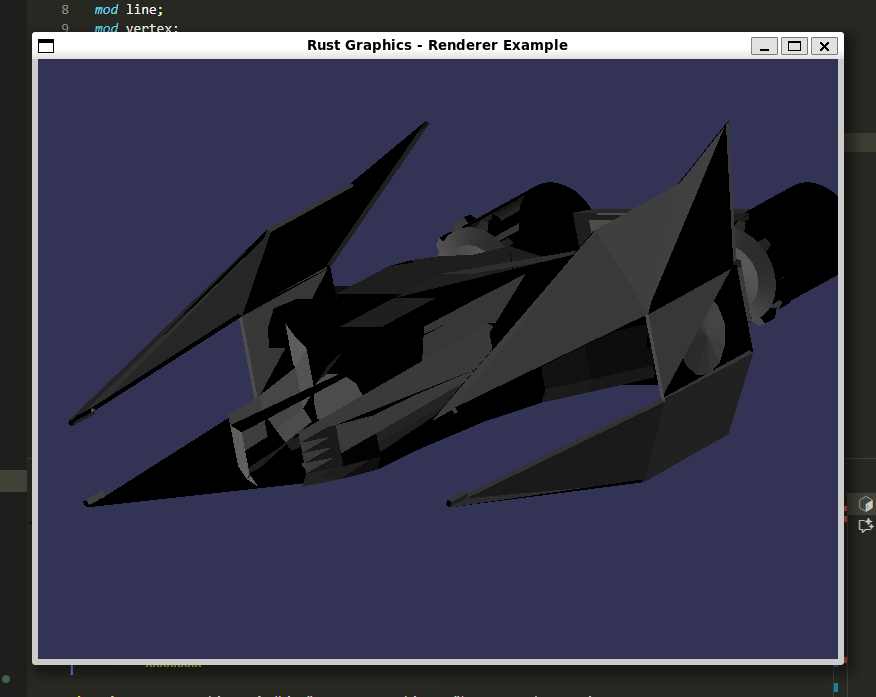

# Nave Shading

A 3D ship rendering project with advanced shading effects implemented in Rust.



## Description

This project demonstrates 3D rendering of a spaceship model with various shading techniques including:
- Vertex and fragment shaders
- 3D transformations and projections
- Real-time lighting effects
- Texture mapping and material properties

## Features

- **3D Model Loading**: Load and render .obj files with materials
- **Advanced Shading**: Multiple shader implementations for realistic lighting
- **Real-time Rendering**: Interactive 3D visualization using minifb
- **Mathematical Operations**: Linear algebra operations with nalgebra

## Requirements

- Rust (latest stable version)
- Cargo package manager

## Installation and Usage

1. Clone the repository:
```bash
git clone https://github.com/FelipeAP04/nave_shading.git
cd nave_shading
```

2. Build and run the project:
```bash
cargo run --release
```

Or use the provided script:
```bash
./run.sh
```

## Project Structure

- `src/` - Source code files
  - `main.rs` - Main application entry point
  - `shaders.rs` - Shader implementations
  - `framebuffer.rs` - Framebuffer management
  - `obj.rs` - 3D model loading
  - `vertex.rs` - Vertex data structures
  - `fragment.rs` - Fragment processing
  - `color.rs` - Color utilities
  - `triangle.rs` - Triangle rendering
  - `line.rs` - Line drawing algorithms
- `assets/models/` - 3D model files (Nave.obj, Nave.mtl)
- `Cargo.toml` - Project dependencies and configuration

## Dependencies

- `minifb` - Window creation and pixel buffer display
- `nalgebra` - Linear algebra operations
- `nalgebra-glm` - GLM-style mathematics functions
- `tobj` - Wavefront OBJ file loading

## License

This project is part of a computer graphics course implementation.